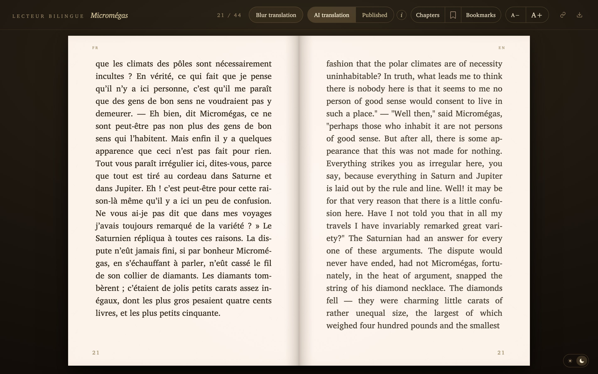
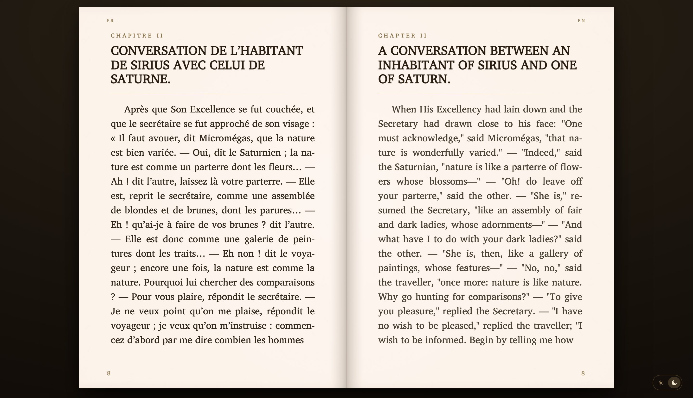
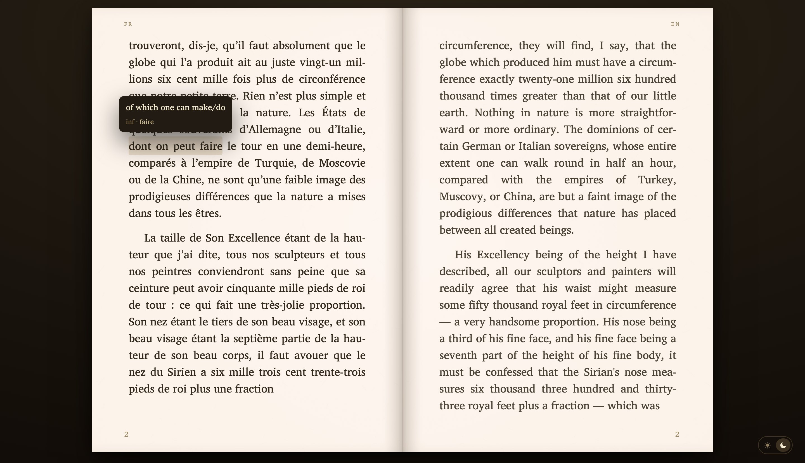
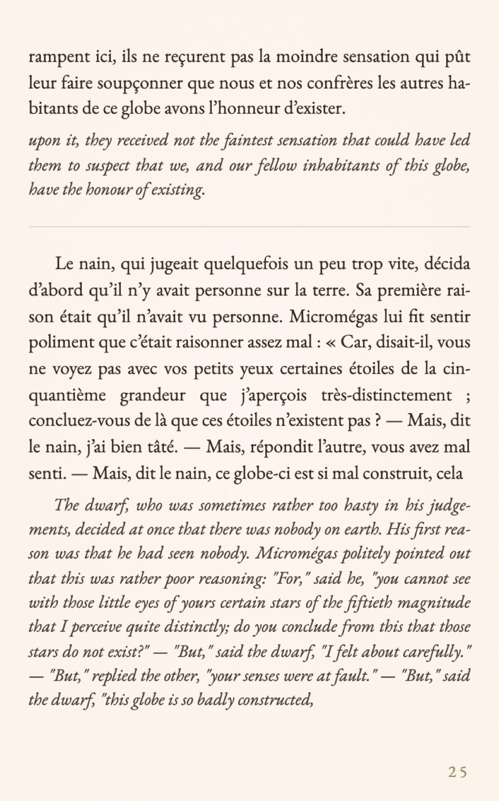
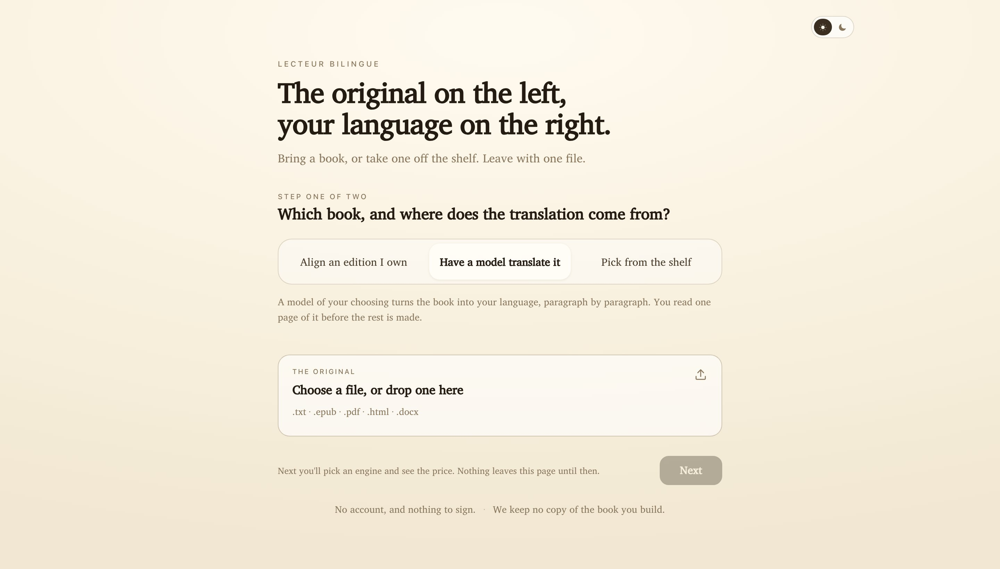
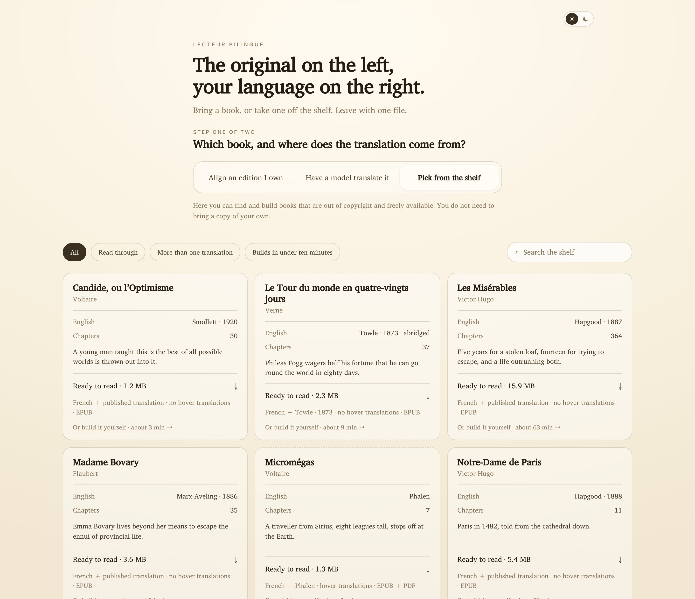
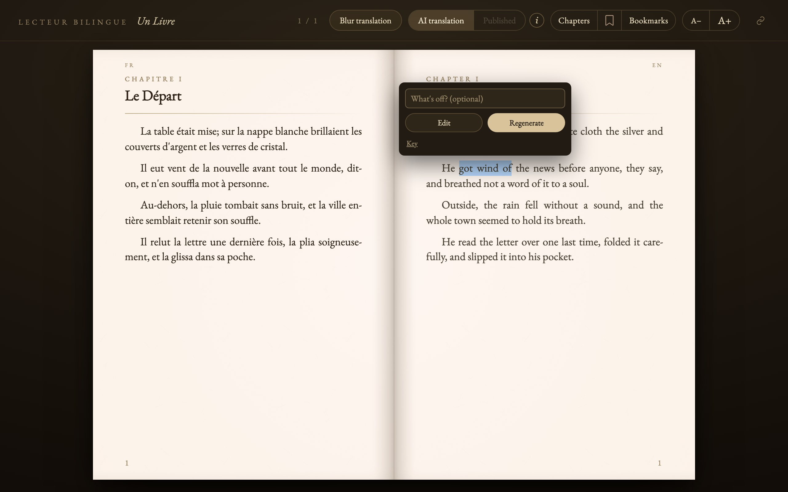

# biread

Turn a French book into a single self-contained HTML file: an open-book spread
with the French on the left page and an English translation on the right,
paginated at runtime like a real book. It reads `.txt`, `.epub`, `.pdf`, `.html`
and `.docx`.

The output is one file. No server, no network, no build step — open it in a
browser, or email it to someone.

There are three ways to get the right-hand page, and they are the same three on
the command line and in the [web builder](web/README.md):

- **Have a model translate it** — bring the French, and the translation is made
  paragraph by paragraph and cached.
- **Align an edition you own** — bring both books, and the published translation
  is matched to the French *by meaning*, so every word stays its translator's.
- **Pick from the shelf** — take a book that is already out of copyright. Both
  editions are fetched from Wikisource and Standard Ebooks; biread stores two
  page names per book and never a word of text.

<p align="center">
  
</p>

<p align="center">
  
  <br>
  <sub><em>Each chapter opens on a fresh spread, its heading facing its translation.</em></sub>
</p>

<p align="center">
  
  <br>
  <sub><em>Hover a phrase for its translation in context. The target is a
  <em>unit</em>, not a word — an article or a preposition is glossed together with
  the word it attaches to — and a verb also shows its infinitive, with the passé
  composé beside a passé simple.</em></sub>
</p>

<p align="center">
  
  <br>
  <sub><em>On a phone, the spread folds into a single column — or export an EPUB
  with <code>--epub</code> and read the spread in Apple Books (best on a tablet
  or in landscape).</em></sub>
</p>

## In the browser, with no install

The same pipeline runs entirely client-side in the [web builder](web/README.md),
via Pyodide. A reader brings their own model — a local Ollama, or their own
OpenRouter key — and no key and no book text ever reaches a server of ours.

<p align="center">
  
  <br>
  <sub><em>Two steps. The first asks only which book and by which route; the
  price and the engine come second, after you have read a sample page.</em></sub>
</p>

<p align="center">
  
  <br>
  <sub><em>A reader holding nothing can still leave with a book. Each card says
  only what the source itself says — the translator and year the wiki names, and
  whether anyone has read that pairing through.</em></sub>
</p>

## Quick start

```sh
python -m venv venv && source venv/bin/activate
pip install -r requirements.txt
cp .env.example .env          # then add your API key

python -m biread book.txt --dry-run          # what would this cost?
python -m biread book.txt -o output/
```

`--dry-run` needs no API key, so you can price a book before setting anything up.

## Options

| Flag | What it does |
| --- | --- |
| `-o, --output DIR` | Where to write the HTML (default `output/`) |
| `--lang LANG` | Language to translate into (default `english`); each language is a fresh translation, built on the runner's own key |
| `--published FILE` | Also show a published translation (in the target language) you already own |
| `--title TEXT` | Title in the reader header (default: from the filename) |
| `--author TEXT` | The book's author, written into the EPUB metadata and the PDF title page |
| `--gloss` | Annotate the French for hover translation (costs extra; see `--dry-run`) |
| `--revise` | Let a reader correct the AI translation in the reader — by hand, or on their own key |
| `--builder-url URL` | Where the reader can cross to the builder, as a quiet corner arrow. Omit it and no arrow appears, so a shared book never points at nothing |
| `--epub` | Also write a fixed-layout EPUB: the French and English as a locked spread, like the reader (needs `[browser]`) |
| `--pdf` | Also write a print PDF, French and English side by side (needs `[browser]`) |
| `--cache-dir DIR` | Where translation caches live (default `cache/`) |
| `--dry-run` | Report uncached work and an estimated cost, then stop |
| `--force` | Proceed with books above 2,000 paragraphs |
| `--respace` | Where a file is a scan, ask the model to put back the spaces its OCR lost (costs extra; see below) |
| `--rebuild-cache` | Discard a cache written by an incompatible version |

## Cost, caching, and interruptions

Four things cost money — translating, `--gloss`, `--respace`, and aligning two
editions, which pays for embeddings. Everything else is pure transformation of
text you already have, which is why `--dry-run`, the exports and re-rendering are
free. Every paragraph is cached by content hash the moment it comes back, so:

- Re-running a finished book costs nothing.
- Interrupting mid-run loses at most the batch in flight.
- `MAX_COST_USD` stops a run cleanly once the running estimate crosses it. Raise
  it and re-run to continue where you left off.

The cap can only be enforced for models with known pricing. For anything else,
set `PRICE_PER_MTOK` in `.env` — otherwise biread warns and runs uncapped.

`cache/` is the expensive, rebuildable asset. Back it up by copying the
directory; it is plain JSON.

## Choosing the translation language

The right-hand column is English by default. Pass `--lang` to build into another
language instead:

```sh
python -m biread french.txt --lang spanish
```

Each book is built into a single language, and every language is **self-serve**:
someone who would like an edition builds it themselves — from the same French
source, on their own key. The English build is untouched, nothing generates other
languages on its own, and a new language is created, and paid for, by the reader
who asked for it. You only ever build the languages you choose.

The source stays French; the translation, the glosses, the hyphenation, and the
reader's controls all follow the target, while the *Lecteur bilingue* masthead
stays French as the reader's signature. The languages live in
`biread/targets.py` — English, Spanish, Italian, German, and Portuguese so far,
and adding another is one row.

## Reading a published translation alongside

```sh
python -m biread french.txt --published english.txt
```

Published translations do not preserve paragraph breaks — translators split a
paragraph of dialogue into several, or merge two into one — and a published
edition carries matter the source has none of: a title page, a transcriber's
note, footnotes set as their own paragraphs. Pairing by position gets this
badly wrong: on the bundled Micromégas the published edition has 34 paragraphs
of front matter before the text even starts.

So biread aligns by content instead, using the generated translation as a
pivot. That translation is tied to each French paragraph exactly, by
construction, which turns the problem into matching English against English.
Each published paragraph is matched to the one it most resembles, in reading
order; anything resembling nothing — front matter, footnotes — is left out, and
a French paragraph with no counterpart is left blank rather than filled with a
guess. The toggle in the header cross-fades between the two English columns.

On the command line this runs after the translation and depends on it — the
pivot is what makes the match trustworthy. There is no wordless shortcut: two
translations of the same book share their *meaning*, not their vocabulary, so
matching them without a model means matching on surface tokens, and that has a
ceiling no amount of tuning raises. Where the two editions still refuse to line
up, biread reports the coverage it got and warns that the published column is
thin — it never fills the gap with a guess.

`align.py` also takes an embedding function instead, and then matches the two
editions directly in a shared multilingual space — by meaning, with no
translation of its own to pivot through. That is the path the
[web builder](web/README.md) uses for a reader who brings both books, on a local
model or a cloud one. The CLI does not expose it yet.

## How pages are laid out

Pagination happens in the browser, against the real page box, one chapter at a
time. Paragraphs fill a page until the next one won't fit; a paragraph too tall
for a whole page continues onto the next, with both columns broken at the same
fraction through it so French and English meet again where it ends. A resumed
paragraph starts flush instead of indented, as in a printed book. Pages never
scroll.

## In the reader

Click either half of the book, or `←` / `→` / `Space` / swipe, to turn a page;
hold Shift to jump ten. `A−` / `A+` resize the text and repaginate around where
you are. **Blur translation** hides the English until you hover a paragraph.
The star bookmarks a spread, the ribbon removes it, and your place is restored
next time — all stored as positions in the book, so they survive resizing the
window or changing the font size.

## Correcting the translation

biread is for readers who care about the prose — reading a French book for the
pleasure of the language, with a translation at their elbow. The generated
English is genuinely good and carries most of the book, but it is not a human
literary translator, and for a reader who notices such things a single phrase
that rings false — *got wind of* where the ear wanted *caught wind of* — is
enough to break the spell.

`--revise` hands that reader the pen. Any line can be made to read the way they
would have it, so the reading stays unbroken and the text becomes, quietly,
theirs. Select the phrase in the AI column and a small panel offers two ways to
set it right.

<p align="center">
  
  <br>
  <sub><em>Select an awkward phrase to fix it — type the correction by hand, or
  have it regenerated in context.</em></sub>
</p>

- **Edit** — type the correction yourself. No key, no cost, instant.
- **Regenerate** — have the selected span rewritten in context, with an optional
  note on what's wrong. This one calls a model, so it runs on the **reader's own
  key**, never yours, using the provider the book was built with. A reader who
  has no key still gets the by-hand edit.

Nothing is spent on your behalf, and no price, token, or key figure ever appears
in the reader. A fix is a private, reversible override kept in the reader's own
browser — a small ↺ puts the original back — and the file you published is never
touched. Like a bookmark it is per-browser; a reader carries their corrections to
another browser with the *copy edits* link (kept separate from the page link, so
a shared page never carries private edits). Automatic cross-device sync would
need a server, which is a different project.

## Saving your place

Progress saves itself. Every page turn records where you are; the star records a
bookmark. Reopen the book and it offers to resume. There is no account to make
and no button to press — nothing is uploaded, because there is nowhere to upload
it to.

It is kept in the browser's `localStorage`, under keys prefixed `biread:<book>:`.
Two consequences follow from that, both by design:

- **It is per-browser, per-device.** Your phone and your laptop keep separate
  places; two people sharing one browser share one place. That is the price of
  having no login, and for a book you hand around it is usually the right one.
- **Clearing the browser's site data resets it.** Private/incognito windows
  start blank and forget on close. Nothing else touches it.

Each book is keyed by its own slug, so several biread books on one site do not
collide.

Because saving is entirely client-side, **hosting is just static files** —
GitHub Pages, an S3 bucket, or a file on disk all behave the same. Anyone who
opens the page gets their own autosaving copy, no backend and no sign-in.

### Carrying your place to another device

The address bar always points at your place (`…/book.html#p42b7.51`), updated
silently as you read and as you bookmark. That link *is* your reading state —
the page (`p42`) and every bookmark (`b7.51`) — so it travels where local
storage cannot: copy it (the link button by the page counter does this and
flashes *Link copied*) and open it on a phone to arrive at the same page with
the same bookmarks. Opening a link goes straight there, ahead of any saved
position; the bookmarks it carries are merged into whatever the device already
had, so nothing is lost either way. The one requirement is that the book be
hosted at a shared URL rather than emailed as a local file, since a `file://`
path is not the same on two machines.

What is left, and genuinely needs a server, is silent *sync* — two devices
staying current without anyone copying a link. That is a different project from
this one.

## Exporting to EPUB and PDF

The reader is one interactive HTML file; `--epub` and `--pdf` write static
copies for reading elsewhere. Neither calls the API — they transform text that
is already generated and cached — but each keeps only what its medium can hold.

- **`--epub`** is a fixed-layout e-book that keeps the reader's open-book spread:
  the French on the left page, the English on the right, locked together. It is
  paginated at build time by the reader's own algorithm — both columns break at
  the same point, so a split paragraph meets again where it ends — which means it
  measures the type in headless Chromium and needs the `[browser]` extra (below).
  It best fits a tablet or a Mac in landscape; a phone in portrait shows one page
  at a time. Glosses are left out — a tap target on every phrase turns the page
  into a wall of links and buries the text (the same reason the PDF drops them);
  hover-glossing stays in the on-screen reader.
- **Built with `--published`?** Each format is written twice — one edition from
  the AI translation, one from the published one — and the reader's download hands
  over whichever translation you have open, so the file matches the page you were
  reading. The two are named `… (AI translation)` and `… (published translation)`.
- **`--pdf`** is for print: the French and English side by side in two columns,
  aligned paragraph by paragraph, matching the reader's type. Glosses are left
  out — footnotes for every hover would bury the page. It is printed by headless
  Chromium, so it needs the `[browser]` extra:
  `pip install -e ".[browser]" && playwright install chromium`.

Because both exporters paginate by measuring real type, a book built **in the
browser** comes out with nothing inside it and the download control hidden — the
builder's tab has no way to run a headless Chromium. It can be given one later,
on any machine that has the engine, without rebuilding or paying again:

```sh
python -m biread.formats book.html
```

That reads the finished book back out of its own page, re-derives the chapters
and the translation exactly, and puts the EPUB inside the file where a download
has always lived.

## When the file fights back

Most of biread's difficulty is not translation. It is that a real book arrives
damaged, and every stage downstream assumes clean paragraph text. So there is a
repair layer between extraction and cleanup, and its rule throughout is that a
repair must be **corroborated by the file itself** — never inferred from shape,
and never written by a model.

- **`normalize.py`** undoes what an extractor does to a page: whitespace runs,
  words hyphenated across a line break, running headers, and a heading word
  marooned from its numeral. It reads a scan's *indentation* to find where
  paragraphs begin, which is the compositor speaking rather than us guessing.
- **`segment.py`** handles an edition that arrived with its paragraph breaks
  gone. Where a second edition is in play, the flat one is cut to the other's
  shape — free, instant, no model, and it recovers 98–100% of the paragraphs on
  the books it has been measured against. Where there is no counterpart, the
  model is shown numbered sentences and answers with the numbers that begin a
  paragraph, so it cannot rewrite a word even in principle.
- **`notes.py`** removes footnotes only where the prose actually refers to them.
  A paragraph opening `1.` is a footnote in one book and a list in another, and a
  note left in is untidy where a deleted sentence is unrecoverable.
- **A scan is weighed and named.** A photograph of a book carries about 80 bytes
  of file per character of text, where a typeset PDF sits between 1 and 4, so
  biread can tell you before you pay. It does not silently correct the
  misreadings; `--respace` will ask a model to put back the spaces OCR lost
  (`isvery` → `is very`), and even then only the *spacing* is kept — the reply is
  walked against the original character by character and the passage rebuilt
  from the original's own characters, so a model that rewrites a word is thrown
  away entirely.

## Adding a format

`.txt`, `.epub`, `.pdf`, `.html` and `.docx` today. An extractor's only job is
file → raw string: subclass `Extractor` in `biread/extract/`, declare its
`suffixes`, and register it in `EXTRACTORS`. Repair, boilerplate stripping and
chapter detection all happen downstream, so nothing else changes.

Non-UTF-8 sources are decoded as cp1252 if UTF-8 fails, which covers most
legacy French texts.

## Layout

```
biread/
  cli.py          argument parsing and everything the user sees printed
  extract/        source file -> raw text (.txt .epub .pdf .html .docx)
  normalize.py    raw text -> repaired: the injuries an extractor inflicts, and
                  the paragraph breaks a conversion dropped, undone first
  cleanup.py      raw text -> chapters of clean paragraphs
  segment.py      an edition that lost its paragraph breaks -> cut to the shape
                  of the other edition, where there is one
  notes.py        footnotes and their markers, removed where the prose confirms
  spacing.py      words an OCR ran together, put back apart (--respace)
  translate.py    paragraphs -> the target language, batched and cached
  align.py        a published translation -> matched to the French by meaning
  gloss.py        per-paragraph hover units; width judged at render
  language.py     what glossing needs to know about the source language
  targets.py      one row per target language: name, chapter word, reader UI
  build.py        the pipeline shared by the CLI and the in-browser builder
  render/         book -> one HTML file (templates/ holds the real reader)
  export/         epub.py, pdf.py, and refit.py, which reads a finished book
                  back out of its own page so a format can be made later
  wikisource.py   two page names -> two editions, resolved and fetched
  standardebooks.py  a second library, English only
  shelf.py        the curated books, and what each one honestly claims
  publish.py      shelf book -> a file ready to hand out, then approved by hand
  formats.py      any finished book -> the same book with its EPUB inside it
  check.py        a finished book looked at where books break
  llm/            one thin client per provider
  cache.py        content-hash JSON cache, merges on write
  config.py       environment, models, pricing
```

Three commands beyond `python -m biread`:

```sh
python -m biread.shelf                  # list the shelf; --check re-measures it
python -m biread.publish <slug>         # build a shelf book, then look at it
python -m biread.formats <book.html>    # put an EPUB inside a book already built
```

The reader itself is `biread/render/templates/reader.{html,css,js}` — plain
files, edited as plain files. `render/__init__.py` only inlines the fonts and
paper texture and substitutes the book data.

## Tests

```sh
pip install -e ".[dev]"
pytest
```

That is about 1,080 Python tests, and **no test touches the network or needs a
key**, so the whole suite runs for free as often as you like. The model is a
fake that echoes structured replies, including malformed and truncated ones, and
the provider clients are tested against stubbed SDK responses.

The reader and the builder are driven in a real browser, because their bugs live
in layout and timing — pagination measured against a box that had not been laid
out yet, a drag target destroyed mid-gesture — and none of those are reachable
without a rendering engine. In two browsers, in fact: Safari has faults Chromium
cannot see (it once broke a shelf card across a column boundary in spite of
`break-inside: avoid`), so every one of those tests runs twice. They skip unless
the browser extra is installed:

```sh
pip install -e ".[browser]" && playwright install chromium webkit
pytest tests/test_reader_js.py       # 76 tests × 2 engines, the reader
pytest tests/test_builder_js.py      # 90 tests × 2 engines, the builder
pytest tests/test_gloss_pool_js.py   #  8 tests × 2 engines, the gloss pool
BIREAD_ENGINES=chromium pytest tests/test_reader_js.py   # one engine, when it must be quick
```

WebKit is roughly six times slower than Chromium, so a quick loop is worth
narrowing and a merge is not. The EPUB and PDF export tests need the same extra,
since both exporters paginate by measuring real type in headless Chromium.

## License

[MIT](LICENSE) — use it, change it, ship it; just keep the copyright notice.
